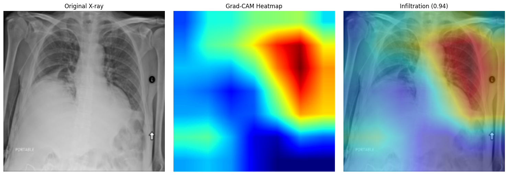
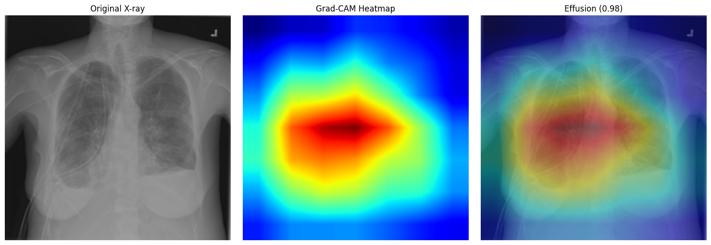
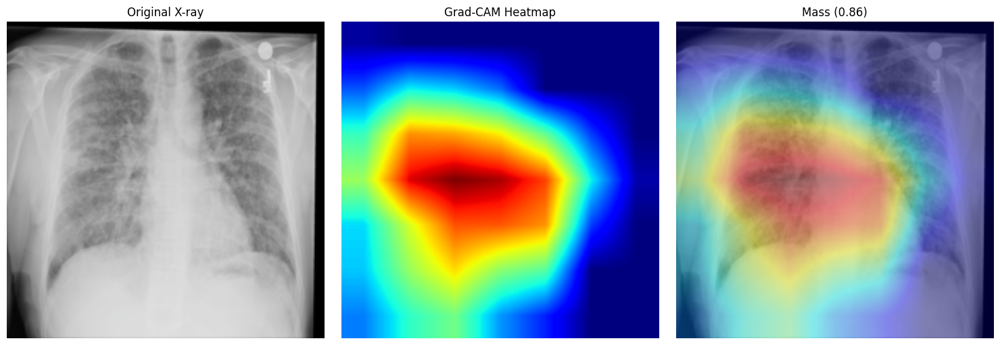
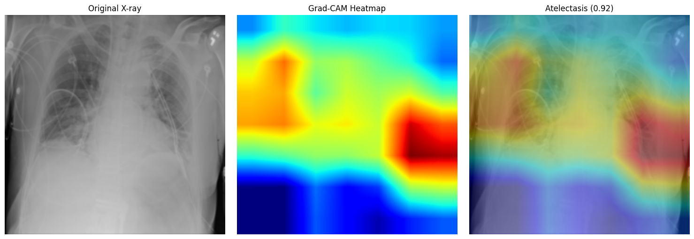
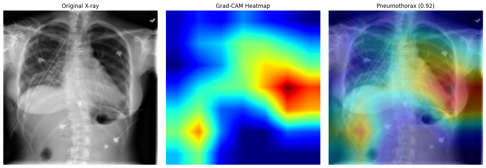
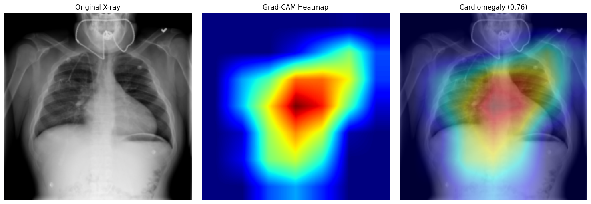

# Chest X-ray Disease Classification (Multi-Label)

A PyTorch transfer-learning project that classifies chest X-rays for 14 thoracic diseases (multi-label) using a pretrained ResNet-18, with Grad-CAM interpretability.

## Overview

- **Dataset:** [NIH ChestX-ray14](https://www.kaggle.com/datasets/nih-chest-xrays/sample) (5,606-image sample subset)
- **Task:** Multi-label classification — 14 diseases + "No Finding," predicted independently per image
- **Model:** ResNet-18 (ImageNet-pretrained), final layer replaced for 15 outputs
- **Approaches compared:** Feature extraction (frozen backbone) vs. fine-tuning (unfrozen `layer4`)
- **Interpretability:** Grad-CAM heatmaps on `layer4`
- **Evaluation:** Patient-level train/val/test split (70/15/15) to prevent data leakage

## Results (validation set, threshold = 0.4)

Three approaches were trained and compared:

| Approach | Outcome |
|---|---|
| Feature extraction (backbone frozen) | Stable baseline, AUC ~0.60–0.83 across classes |
| Fine-tuning, 10 epochs (`layer4` unfrozen) | Overfit — training loss dropped to 0.02, but precision/recall collapsed to 0 on 8/15 classes |
| **Fine-tuning, 4 epochs (final model)** | Best result — improved AUC over feature extraction on most classes, without the overfitting seen at 10 epochs |

**Fine-tuned model — per-class metrics (validation set):**

| Disease | Precision | Recall | F1 | AUC | Support |
|---|---|---|---|---|---|
| Atelectasis | 0.180 | 0.556 | 0.272 | 0.727 | 72 |
| Cardiomegaly | 0.091 | 0.053 | 0.067 | 0.789 | 19 |
| Consolidation | 0.077 | 0.194 | 0.110 | 0.717 | 31 |
| Edema | 0.100 | 0.062 | 0.077 | 0.764 | 16 |
| Effusion | 0.216 | 0.539 | 0.309 | 0.759 | 89 |
| Emphysema | 0.158 | 0.158 | 0.158 | 0.852 | 19 |
| Fibrosis | 0.000 | 0.000 | 0.000 | 0.520 | 15 |
| Hernia | 0.000 | 0.000 | 0.000 | 0.659 | 2 |
| Infiltration | 0.234 | 0.733 | 0.355 | 0.663 | 150 |
| Mass | 0.188 | 0.283 | 0.226 | 0.650 | 46 |
| No Finding | 0.647 | 0.743 | 0.692 | 0.710 | 452 |
| Nodule | 0.158 | 0.375 | 0.222 | 0.667 | 56 |
| Pleural_Thickening | 0.138 | 0.105 | 0.119 | 0.613 | 38 |
| Pneumonia | 0.000 | 0.000 | 0.000 | 0.610 | 10 |
| Pneumothorax | 0.172 | 0.268 | 0.210 | 0.705 | 41 |

Note: `Fibrosis`, `Hernia`, and `Pneumonia` have very few validation examples (10–15 support), so their metrics are noisy and not statistically meaningful — a known limitation of training on the sample subset rather than the full 112k-image dataset.

## Grad-CAM

Grad-CAM heatmaps were generated using forward/backward hooks on `model.layer4` of the fine-tuned model. Comparing against the feature-extraction model on the same image showed the fine-tuned model attending more consistently to actual lung tissue, rather than image borders or non-anatomical markers.

**Examples across different predicted diseases (fine-tuned model, high-confidence predictions):**

| Infiltration (0.936) | Effusion (0.983) | Mass (0.857) |
|---|---|---|
|  |  |  |

| Atelectasis (0.925) | Pneumothorax (0.924) | Cardiomegaly (0.764) |
|---|---|---|
|  |  |  |

## Key learnings / honest limitations

- Trained on the 5,606-image NIH sample subset, not the full 112k-image dataset (time constraint) — the full dataset would likely improve performance on rare classes (Hernia, Pneumonia, Fibrosis had very few examples here).
- Severe class imbalance (up to ~230x between the rarest and most common labels) was addressed using `pos_weight` in `BCEWithLogitsLoss`, capped at 20x after uncapped weights caused unstable, non-converging training.
- Patient-level train/val/test splitting was used throughout, since the dataset contains multiple X-rays per patient — splitting by image instead would let the model "see" a patient during training and get evaluated on them later, inflating results.
- An initial fine-tuning attempt at 10 epochs overfit badly (training loss near zero, but validation precision/recall collapsed to 0 on more than half the classes). This was caught by checking validation metrics rather than trusting the training loss curve, and was resolved by reducing to 4 epochs.
- Accuracy is intentionally not reported as a headline metric — with this level of class imbalance, a model that never predicts rare diseases can still score high accuracy while being clinically useless. Per-class precision, recall, F1, and ROC-AUC are used instead.

## How to run

Open `chest_xray_classifier.ipynb` in Google Colab (GPU runtime recommended), add your Kaggle API credentials to Colab Secrets (`KAGGLE_USERNAME`, `KAGGLE_KEY`), and run all cells top to bottom.
